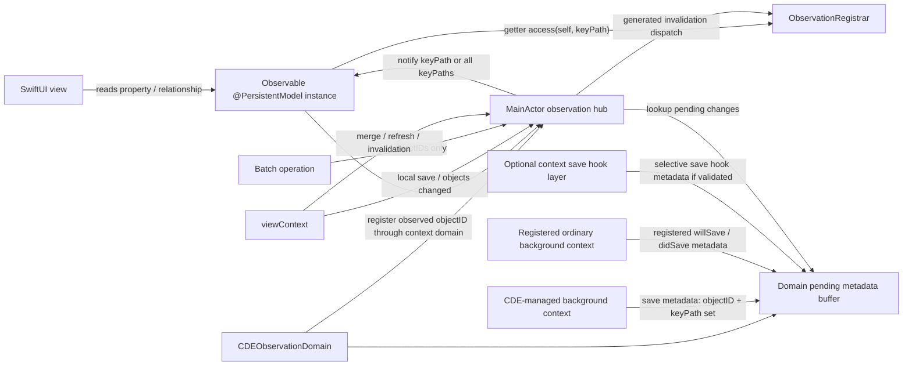
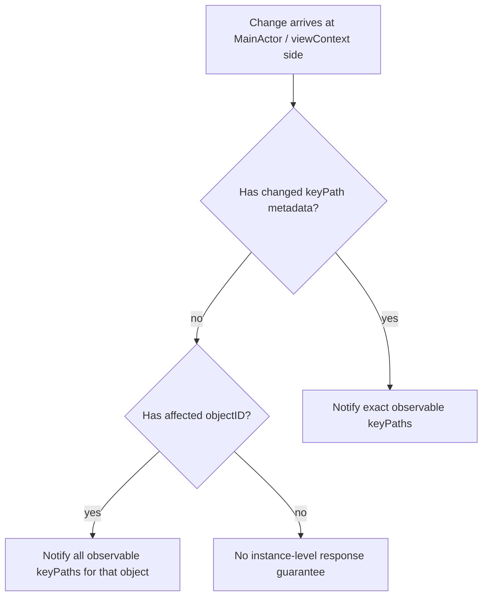
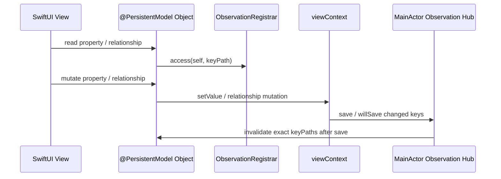
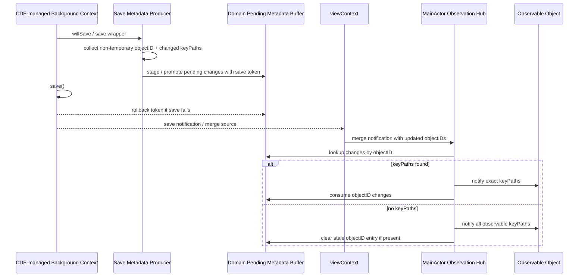
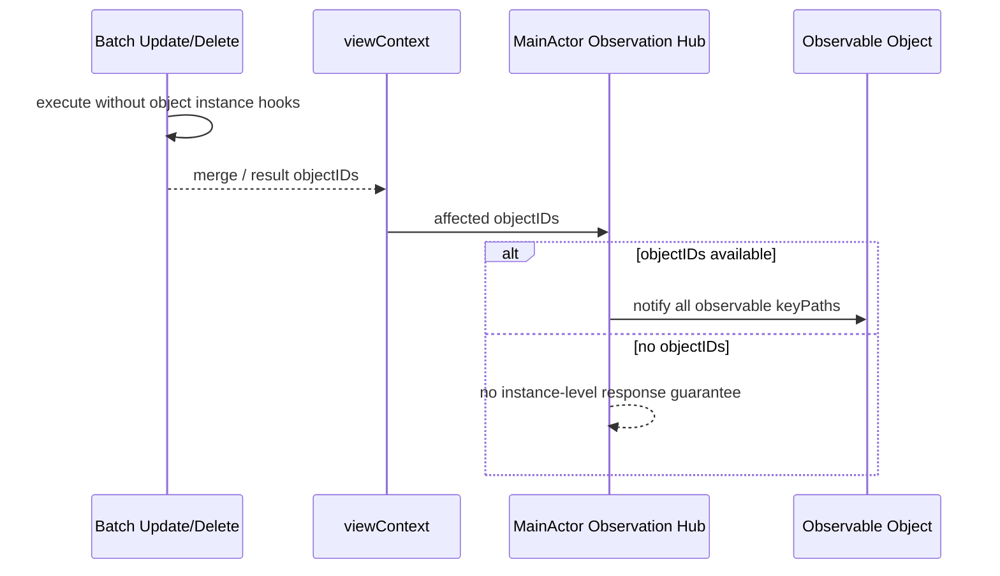
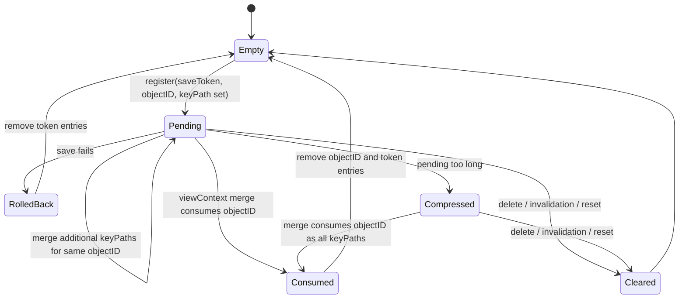
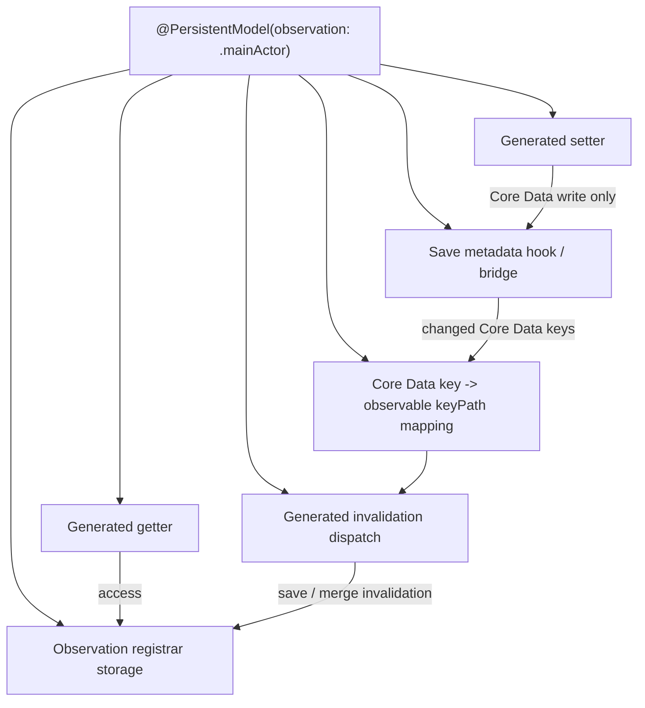
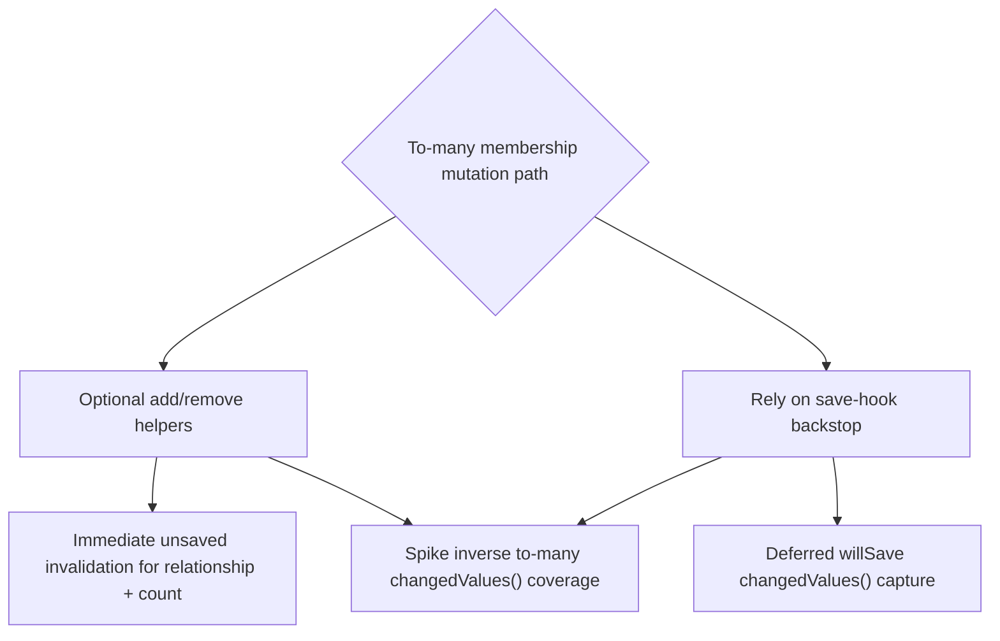

# MainActor Observation Mechanism

> Research and mechanism reference for [#11](https://github.com/fatbobman/CoreDataEvolution/issues/11).
> This document describes the validated mechanism with diagrams; the spike evidence (T01-T22) is a
> historical research record from #11/#12. The ordered, testable build plan is
> [`MainActorObservationImplementationPlan.md`](MainActorObservationImplementationPlan.md), tracked by
> [#12](https://github.com/fatbobman/CoreDataEvolution/issues/12).
> User-facing setup and API guidance lives in
> [`ObservationGuide.md`](../ObservationGuide.md).

## Scope

This capability is an opt-in macro feature for platforms that support Swift Observation
(iOS 17+ / macOS 14+ family).

It is not a universal Core Data observation system. The MVP focuses on:

- `@PersistentModel(observation: .mainActor)`
- a retained `CDEObservationDomain(container:)` as the activation and lifecycle owner
- MainActor / `viewContext` as the only Observation consumer
- CDE-managed save paths as change metadata producers
- explicitly registered ordinary background contexts as change metadata producers
- selectively installed context save hook exploration for framework-owned contexts
- explicit fallback when a merge can provide object IDs but not changed key paths

## Design Intent: Cognitive Liberation Is Unconditional

The target is the SwiftUI view-construction mental model, not throughput. Today, making an
`NSManagedObject` reactive in SwiftUI forces `@Observable` wrapper layers; a deep read path such as
`memo.itemData.item.symbol` forces several of them — one per relationship hop — just so a leaf change
can drive the view. This feature removes those layers: a view reads the object graph directly, and
each object on the read path subscribes itself.

The defining property is that **this liberation is unconditional and orthogonal to precision.** It
comes from per-instance subscription — each object is observed because the view *read* it — not from
how precisely a later change is detected. The mechanism never walks the graph or computes a transitive
closure; the "penetration" is just Observation re-subscribing along whatever the view actually read
(see the Subscription axis below).

Two consequences follow, and they are the core positioning:

- **The structural win holds even under all-key fallback.** Precision (the Detection axis) only decides
  whether a *sibling* property's change *also* wakes a reader. It never decides whether the wrapper
  layers can be deleted — they always can. Precise where CDE can recover the changed key (local
  `viewContext` save, CDE-managed save, registered producer); object-level all-key fallback where it
  cannot (unregistered context, batch, CloudKit import). Both delete the same wrapper layers.
- **The all-key fallback floor equals the existing Combine ceiling.** Object-level all-key invalidation
  is the same granularity as `NSManagedObject.objectWillChange` (`@ObservedObject` / `@FetchRequest`):
  "this object changed → its readers re-render." It is, if anything, tighter, because Observation only
  wakes views that actually *read* the object, whereas `@ObservedObject` wakes every holder. Worst case
  is therefore parity with today's Combine path; the precise paths are strictly better (property-level,
  which `objectWillChange` cannot express); no path is meaningfully worse. Performance is not a reason
  to avoid the feature.

Hence the explicit ordering — mental model first, performance second: the model improvement is the
guaranteed deliverable; precision is a layered, degradable optimization on top of it.

## Observation Boundaries (Two Axes)

The whole reactivity contract reduces to one precondition: **CDE generated the accessor.** That gives
two independent boundaries. A property is fully reactive only when it clears both.

### Subscription axis — what can be observed at all

Observation subscribes by calling `access(self, keyPath)` inside a generated getter. A property whose
accessor CDE does **not** generate has no injection point, never subscribes, and is therefore not
observable *at all* — not even objectID fallback. This is a hard boundary, not a degradation:

- **`@NSManaged` (raw) properties.** Their accessors are synthesized dynamically by Core Data at
  runtime (`@dynamic` / KVC); there is no Swift getter body for CDE to instrument. Out of scope by
  construction. CDE should skip auto-attaching `@Attribute` to them and, under
  `observation: .mainActor`, emit a warning (not an error — raw `@NSManaged` must keep compiling).
- **User-written custom getters** over raw storage are equivalent: no CDE-generated getter, no
  `access(...)`.
- A **computed property built on observable stored properties stays reactive**, because it reads those
  instrumented getters. No special handling is needed; reactivity composes through the read.

Only CDE-generated accessors carry the injection point: `@Attribute` storage (`.default`, `.raw`,
`.codable`, `.transformed`), generated to-one / to-many relationships, the top-level `@Composition`
property, and generated to-many count accessors.

### Detection axis — whether a change yields a precise key path

Given an observable property, a change is property-precise only when its source can hand CDE the
changed Core Data key (CDE-managed save or an explicitly registered producer); otherwise it degrades to
objectID + all observable key paths, or — with no objectID — to no instance-level response. This axis
is the "Change Sources" table below.

The two axes are orthogonal: an `@NSManaged` attribute changed by a CDE-managed save still has a
precise *detection* result, but it can never *subscribe*, so it stays invisible to a SwiftUI reader.

## Core Roles



## Activation Contract

`@PersistentModel(observation: .mainActor)` is the model-generation opt-in. It generates registrar
storage, getter access calls, field mapping, and invalidation dispatch. It does not by itself install
container observers or merge routing.

Runtime routing is activated by a retained `CDEObservationDomain(container:)` for the container's
`viewContext`. The domain owns the MainActor hub, observed-object weak table, pending metadata,
producer registrations, optional hook registrations, and cleanup. Generated getter access should
call a CDE runtime wrapper that performs two actions:

- call `ObservationRegistrar.access` for the concrete property
- if the object belongs to a `viewContext` with an active observation domain, register the object's
  current object ID in that domain's weak observed-object table

This keeps the user-facing model opt-in as one macro argument while still making the container-level
activation explicit. There is no per-object user registration step. If an opt-in model is used
without a retained domain for its `viewContext`, getter access can still compile and record local
Observation access, but CDE does not promise save / merge invalidation routing.

## Change Sources

The MVP model has four source classes.

| Source | Merge? | Changed key paths? | Strategy |
|---|---:|---:|---|
| `viewContext` change | No | Yes | Collect local changed key paths and notify precisely. |
| CDE-managed or registered background context change | Yes | Yes | Save side records `objectID + keyPath set`; merge side consumes it. |
| selectively hooked framework-owned context | Yes | Initially observed for CloudKit import; stability to validate | Optional hook layer tries to stage `objectID + keyPath set`; failure falls back to objectID-only. |
| batch operation | Yes | No | If object IDs are available, notify all observable key paths for each object. |

CloudKit / external import remains a special validation target. CDE should not rely on Persistent
History Tracking in its core path because that couples a model-macro feature to container / store
orchestration. A real device-to-device CloudKit probe has shown that a framework-owned import
context can post observable context-change / will-save notifications containing the business entity
object ID and changed Core Data keys before `viewContext` merge. That makes the opt-in notification
hook route worth pursuing. It is not yet a guarantee: if ordering, filtering, cleanup, or platform
coverage proves unreliable, CloudKit precision stays outside MVP and remote imports use
objectID-only fallback.



## Observable Key Paths and Core Data Keys

One Core Data key can back more than one observable key path. A to-many relationship `orders` backs
both `\.orders` and the generated count accessor `\.ordersCount`
(`PersistentModelMemberGeneration.makeToManyCountDecls`). The `Core Data key -> observable key path`
map is therefore one-to-many: invalidating a Core Data key must fan out to every derived key path,
not only the relationship key path. A view that reads only `ordersCount` will not refresh if a
precise invalidation notifies `\.orders` alone. The object-level fallback already covers the count,
because `ordersCount` is itself an observable key path; the real risk is a precise relationship
invalidation that forgets the derived count.

Relationship observation composes per instance. The owning object's relationship key path reflects
only binding-level change:

- to-one: the generated setter is the Core Data write funnel; every assignment (nil -> value,
  value -> nil, A -> B) routes through `setValue(_:forKey:)`. In the save-gated MVP it does not need
  to publish Observation immediately. The save / merge hub invalidates the relationship key path
  after the change is persisted or merged.
- to-many: the key path and its count reflect membership change only. Attribute changes on a target
  instance belong to that target's own key paths and are observed through its own registrar.

Consequence: the "no key path -> all observable key paths" degradation is per-object. It does not
traverse the relationship graph. A deep read path such as `a.b.c.name` subscribes to a, b, and c
individually, so invalidating the one instance that actually changed is enough; Observation
re-subscribes along the path on re-evaluation. The mechanism never computes a transitive closure over
relationships.

## Local `viewContext` Change

Local changes do not need a merge pass. The same MainActor domain can collect changed keys and notify
registered observable instances after save. The save-gated MVP does not require generated setters to
publish Observation immediately; setters only perform Core Data writes.

The `viewContext` is a producer **by construction**: the domain owns it and installs `willSave` /
`objectsDidChange` observers on it at creation, so a plain `viewContext.save()` is property-precise
with no special API. Changed keys are snapshotted in the will-save window (they are empty after
`save()` returns). This is what keeps the explicit-save / no-autosave workflow seamless — read the
graph, save, the exact key paths refresh. The local will-save path and the background merge path are
disjoint, so a change is published once. Background contexts, in contrast, become producers only when
explicitly registered (`registerChangeProducer(context:)`).



Design note: for the SwiftUI view problem, getter instrumentation is the subscription boundary.
Setter instrumentation is only necessary if CDE later chooses to support immediate unsaved UI
refresh. The MVP keeps one invalidation path: save / merge hooks collect changed Core Data keys and
the MainActor hub dispatches generated field invalidation after persistence or merge. This avoids
double invalidation between generated setters and save hooks.

## Background Context Change

The background side acts only as a metadata producer. Observation consumption remains on MainActor.



Design update: `NSModelActor` save wrappers and explicitly registered ordinary background contexts
are both selected MVP producer routes. The remaining design work is the cleanup contract and public
API shape for those routes, not whether ordinary contexts belong in scope. Unregistered arbitrary
contexts stay outside the precise metadata guarantee; framework-owned contexts are handled only by
the separate selective hook exploration.

## Batch Operation

Batch operations bypass managed object instance lifecycle, setters, relationship helpers, and
`willSave()` on individual objects. They are therefore objectID-level only.



## Echo Suppression: Same-Cycle Guard and Cross-Cycle Marker

The merge / refresh fallback above ("no pending keys -> all observable key paths") is unconditional
*only for a genuinely new change*. A precise route — a local `viewContext` save, or a background / merge
route that consumed producer metadata — is dispatched precisely; the same change can then be
re-delivered as an **echo** naming the same object again. By the time the echo arrives the precise
pending is already consumed, so the naive fallback widens it to all observable key paths and wakes
readers of *unchanged* sibling properties (a view reading only `memo.date` refreshes when a save touched
only `memo.content`).

Echoes come in two flavours, by *when* they land relative to the originating route:

- **Same-cycle echo** — within the same Core Data event cycle: a duplicate `didMergeChangesObjectIDs`,
  the refreshed half of one notification, or a duplicate merge-driven `objectsDidChange` refresh.
- **Cross-cycle echo** — a *later* run-loop wakeup, across a `beforeWaiting` sleep, when **any** merge
  re-delivers the change into the `viewContext`. The runtime only sees the `viewContext` merge
  notifications and never inspects the source: re-merging is just the common behavior of
  `NSPersistentCloudKitContainer` (which always enables Persistent History Tracking, even with no
  CloudKit container configured), a parent / child context chain, or a manual `mergeChanges`. Observed
  ~20–90ms later for both `viewContext` and background / `NSModelActor` saves.

The mechanism is deliberately source-agnostic — there is no CloudKit- or PHT-specific code path; it is
all "a merge into the `viewContext` re-delivered a change we already routed". At
`objectID + empty-pending` granularity an echo and a genuinely new change are identical; the only
discriminator is *which event cycle the notification belongs to*. Two cooperating, timing-based
mechanisms supply that discriminator.

### Same-cycle guard (`sameCyclePreciseMergeSuppressions`)

The baseline, used when cross-cycle suppression is disabled (plain containers, which produce no
cross-cycle echo). Arming a precise route guards object X; the three fallback sites (the empty-pending
branch of `routeMerge`, the refreshed half in `handleViewContextDidMergeObjectIDs`, and the refresh path
in `handleViewContextObjectsDidChange`) swallow a still-guarded object instead of widening it. It is
cleared on the first `kCFRunLoopBeforeWaiting` — the run loop fires that only once all queued work of the
current cycle has drained — so it covers same-cycle echoes but, by design, not echoes across a sleep.

### Cross-cycle marker (`preciseRouteEchoMarkers`)

The robust mechanism for cross-cycle echoes, gated by `CDEPreciseRouteEchoSuppression` — `.auto` is a
default heuristic (on for `NSPersistentCloudKitContainer`, the container that in practice re-merges its
own saves), with `.on` / `.off` to force it for any other re-merging setup (e.g. PHT on a plain
container). When enabled, **every** precise route arms the marker — a local `viewContext` save *and* a
background / merge route, since both echo back cross-cycle (confirmed on device under batch load). It
then **consume + skip**s the later echo:

- It carries only the `objectID`, never a field set, and never re-dispatches: the precise dispatch
  already happened, so the echo is simply swallowed. (Deliberately *not* producer pending, whose job is
  to *re-route* a field set when its merge lands — opposite intent.)
- `honored` flips true on the first echo hit; the `beforeWaiting` cleanup then drops honored (and
  TTL-expired) markers, while an *un-honored* marker **survives across drains** until its echo lands.
  This is exactly why it is immune to run-loop timing where the guard is not: it clears one drain
  *after* the echo, not on the first drain.
- Hard lifetime bounds so a stale marker can never eat a later save: cleared at the next
  `viewContextWillSave`, plus a TTL backstop (~2 s, well above the observed echo latency) for an
  opted-in save whose echo never arrives.

When enabled, the marker subsumes the guard's same-cycle coverage (a same-cycle echo simply honors the
marker in the same turn); the guard remains the disabled / plain-container path. One repeating
`kCFRunLoopBeforeWaiting` observer serves both tables and self-removes once both are empty.

### What does **not** work (both regressed during development)

- **Dropping the suppression** (always all-key on empty pending) re-introduces the sibling-wake bug.
- **A timer-based clear** (`Task { await Task.yield() }`, a fixed number of hops, or a queued
  `DispatchQueue.main.async`) is a *queued item*, not a *drain observer*: under MainActor load it is
  starved or reordered past the next save, so a stale guard swallows that save's legitimate all-key
  fallback (a flaky "direct save right after an observed save"). The `beforeWaiting` observer is the
  only boundary that is both un-starvable and tied to "the current event cycle has fully drained".

## Spike Results: Save Metadata, Local Keys, Merge Alignment, Batch Fallback

The T03 / T06 / T07 / T08 / T09 / T10 / T12 / T13 / T14 / T15 / T16 / T17 /
T18 / T20 / T21 / T22 spike used a programmatic Core Data model and focused tests in the former
`ObservationSpikeTests` research suite. #13 removed that scaffolding after production runtime,
integration, and field-map tests became the current executable coverage.

### T03 Opt-In API Draft

The current API draft keeps `@PersistentModel` as the declaration site:

```swift
@PersistentModel(observation: .mainActor)
final class Memo: NSManagedObject { ... }
```

This is still a draft, not public API. The spike compares three shapes:

| Candidate | Result |
|---|---|
| `@PersistentModel(observation: .mainActor)` | Preferred for MVP because the observation mode stays with the existing model declaration, exposes the MainActor boundary at the call site, and lets the same macro generate registrar storage, accessors, field mapping, and save-hook glue. |
| `@ObservablePersistentModel` | Technically possible, but splits the model concept across two top-level macros and hides whether the base `@PersistentModel` output also participates in observation. |
| `CDEObservablePersistentModel` / helper registration | Useful as a runtime protocol detail, but not enough as the user-facing opt-in because it cannot generate stored registrar, accessors, or field maps by itself. |

The opt-in path should diagnose at least:

- the attached type is not an `NSManagedObject` subclass
- the attached type is missing explicit `@objc(EntityName)`
- the generated observation members are used below the Swift Observation platform floor
- the consumer path is not MainActor / `viewContext`

Conclusion: keep `@PersistentModel(observation: .mainActor)` as the model opt-in. Runtime protocols
and helper types remain implementation details, but the container-level `CDEObservationDomain` is a
real activation object and ordinary background contexts need a public domain registration API. That
registration is for producer contexts, not for individual model objects.

### T06 Local `viewContext` Changes

Local `viewContext` changes expose key information before save:

- Generated-style setters can remain Core Data write funnels only; the save-gated MVP does not need
  them to call `ObservationRegistrar.withMutation` immediately.
- KVC writes, undo / redo, and inverse relationship maintenance bypass generated setters but remain
  visible through Core Data change hooks, which is why save / merge hooks are the primary
  invalidation path.
- `NSManagedObjectContextObjectsDidChange` can observe current-event keys from the changed object.
- `NSManagedObjectContextWillSave` does not provide changed objects in `userInfo`; a save hook must
  inspect the notification context's `insertedObjects`, `updatedObjects`, and `deletedObjects`
  during the will-save window.
- `changedValues()` is empty after `save()` completes, so the metadata producer must snapshot keys
  before the save returns.

Conclusion: generated getters are required to establish Observation subscriptions. Generated setters
do not need Observation calls for MVP. The save / merge hook is the single invalidation path for
local saved changes, KVC, undo / redo, inverse maintenance, and other generated-accessor bypasses.

### T07 `changedValues()` Coverage Matrix

| Field kind | Observed key source | MVP interpretation |
|---|---|---|
| attribute | `changedValues()` and `changedValuesForCurrentEvent()` contain the attribute key | precise keyPath |
| to-one relationship | changed object contains the to-one key | precise keyPath |
| unordered to-many membership | owner contains the to-many key; inverse child contains the to-one key | precise keyPath plus fan-out to derived count |
| ordered to-many membership | owner contains the ordered to-many key; inverse child contains the to-one key | precise keyPath plus fan-out to derived count |
| inverse relationship maintenance | inverse owner is updated with the inverse relationship key | save-hook backstop can recover membership changes |
| composition backing field | backing storage key is visible | precise top-level composition key; leaf precision remains future work |
| Core Data transient attribute | `changedValuesForCurrentEvent()` contains the key, but `changedValues()` does not | outside save-gated MVP unless an immediate current-event layer is added |
| ignored / non-persistent Swift field | no Core Data key appears | not visible to Core Data hooks |

Conclusion: `changedValues()` is sufficient for persisted attributes, relationships, and composition
backing fields. Transient and ignored fields cannot rely on the save-hook metadata path and should
stay outside the save-gated MVP unless a later immediate Observation layer is designed.

### T08 Core Data Key To Observable Field Fan-Out

The save hook starts with Core Data string keys, but the hub does not need to keep string paths as
the long-term field identity. The spike models a generated field identity table:

```swift
enum FieldID: UInt8 {
  case name
  case children
  case childrenCount
  case profile
}
```

The generated map is one-to-many:

| Core Data key | Observable field IDs |
|---|---|
| `name` | `name` |
| `children` | `children`, `childrenCount` |
| `orderedChildren` | `orderedChildren`, `orderedChildrenCount` |
| `profileStorage` | `profile` |

This gives the runtime two useful properties:

- Core Data boundary code can still consume `changedValues()` string keys.
- Pending metadata and hub routing can store compact field sets, for example a bitset keyed by
  generated `FieldID`, before dispatching to generated key-path invalidation closures.

Conclusion: MVP should generate a Core Data key -> observable field-ID fan-out table. String paths
are acceptable for spike assertions and diagnostics, but the runtime shape should leave room for
compact field sets and generated dispatch. Composition maps to the top-level composition field in
MVP; leaf field IDs remain future work unless the macro later generates real leaf accessors.

### T09 MainActor Observation Hub Lookup

The MainActor hub should maintain its own observed-object weak table keyed by `NSManagedObjectID`.
`registeredObject(for:)` is useful as a comparison point, but it is too broad for notification
filtering:

- A `viewContext` can have registered objects that were never read by SwiftUI Observation. Notifying
  those objects would turn merge routing into "registered object" routing rather than "observed
  object" routing.
- An observed object that is currently a fault can still be notified through the weak table; the hub
  does not need to rehydrate it.
- Released objects are pruned by weak-entry cleanup. Delete and reset should explicitly unregister
  or clear the table.
- Merge handling should iterate only the object IDs from the merge notification. For each affected
  object ID, consume pending metadata to avoid stale keys, then emit an invalidation only when the
  weak table still has a live observed object.
- Historical pending entries that are not part of the current merge are not scanned during lookup.

Conclusion: the MVP hub should use `observed objectID -> weak object` as the primary selection
structure. `registeredObject(for:)` should not create or rehydrate instances and should not be the
main filter.

### T10 `NSModelActor` Save Metadata Producer

The `NSModelActor` path can support a CDE-managed save wrapper:

- The actor updates its background context, snapshots non-temporary `updatedObjects` and their
  `changedValues()` keys, registers a save token in the target domain's pending metadata buffer,
  then calls `save()`.
- The metadata registration happens before the `viewContext` receives merge object IDs.
- If `save()` fails after metadata registration, the wrapper can roll back the token and clear the
  context changes.
- Inserted objects are ignored for property-level metadata; their initial appearance is an insert,
  not an update diff.
- A direct `modelContext.save()` path that bypasses the wrapper can still produce merge object IDs,
  but has no pending keys and therefore must fall back to all observable key paths.

Conclusion: precise background property invalidation requires a CDE-managed save API or equivalent
hook. Direct `modelContext.save()` should be documented as outside the property-level guarantee,
with objectID-only fallback when the merge can still identify affected objects.

### T12 Pending Buffer Lifecycle

The pending metadata prototype is scoped to one `viewContext` / container domain and has two
isolation faces:

- Producer-side staging must be synchronously writable from CDE save wrappers, registered ordinary
  context notifications, and optional framework-owned context hooks. These callbacks may run on
  private Core Data queues, so they cannot depend on an asynchronous MainActor hop before merge
  notification ordering is preserved.
- MainActor consumption and Observation publication remain MainActor-only. The hub reads pending
  metadata while processing `viewContext` merge / lifecycle notifications and then calls generated
  invalidation dispatch on live observed objects.

The spike keeps these invariants:

- `pendingByObjectID` stores the effective pending change for each object.
- `tokenIndex` maps each save token to its affected object IDs.
- Per-token contributions are retained so rollback can remove one token without dropping keys from
  earlier successful tokens for the same object.
- Multiple saves for the same object merge key sets.
- Consuming a merge object ID removes that object from `pendingByObjectID`, `tokenIndex`, and token
  contributions.
- Save failure rollback removes the failed token and clears objects that have no remaining tokens.
- Separate buffer instances do not share pending state, even for the same objectID string.
- Stale precise keys can be compressed to `.allObservableKeyPaths` while retaining the object ID for
  later merge fallback.

Conclusion: pending metadata should be domain-scoped per viewContext/container, not global.
Observation publication and the observed-object table stay MainActor-only, while producer metadata
staging needs a synchronous, thread-safe path. Compression must degrade precision rather than drop
object identity.

### T13 Merge Notification Alignment

Background updates can align save-side keys with merge-side object IDs:

- The background context can snapshot `objectID + changed keys` before save.
- With `viewContext.automaticallyMergesChangesFromParent = true`, the main context posts
  `didMergeChangesObjectIDsNotification` containing the updated object ID.
- Manual `mergeChanges(fromContextDidSave:)` also posts `didMergeChangesObjectIDsNotification` with
  the updated object ID.
- The merge-side planner can use pending keys for exact invalidation. If no pending keys exist for
  the affected object ID, it must fall back to all observable key paths for that object.

Conclusion: the MVP can depend on `didMergeChangesObjectIDsNotification` for merge-side alignment,
while keeping pending-key lookup scoped to the concrete `viewContext` / container domain.

### T14 Batch Update / Delete

Batch operations only support objectID-level fallback:

- `NSBatchUpdateRequest` with `.updatedObjectIDsResultType` returns affected object IDs; merging
  those IDs into `viewContext` posts updated object IDs.
- `NSBatchDeleteRequest` with `.resultTypeObjectIDs` returns affected object IDs; merging those IDs
  into `viewContext` posts deleted object IDs.
- Status-only batch results provide no object IDs, so there is no instance-level response guarantee.
- Batch operations do not provide changed key paths and do not run managed-object instance hooks.

Conclusion: batch update / delete never enter the property-level guarantee. If object IDs are
available, notify all observable key paths for those objects; otherwise the mechanism cannot promise
instance-level response.

### T15 Relationship Semantics

Relationship observation composes by instance, not by walking the object graph:

- A to-one relationship setter is the Core Data mutation funnel for the relationship binding, but
  the save-gated MVP does not publish from that setter. Changing a target object's
  scalar property belongs to the target object's registrar, not the source object's relationship key
  path.
- A deep read such as `root.child.leaf.name` subscribes to each object encountered during the read.
  If a later mutation changes the intermediate relationship binding, that binding invalidates; if it
  changes the leaf scalar, the leaf invalidates. The hub does not recursively fan out through
  relationships.
- If a later immediate-mutation layer adds generated to-many helpers, those helpers must notify both
  the relationship key path and any derived count key path. In the save-gated MVP, the same fan-out
  happens from the Core Data key map when the save / merge hook invalidates fields.
- Core Data inverse maintenance currently supplies a usable save-hook backstop: when moving a child
  from one parent to another, the child carries the to-one key and both old and new owners carry the
  inverse to-many key.
- Ordered and unordered to-many relationship keys both need one-to-many fan-out in the Core Data key
  map, for example `children -> children + childrenCount` and
  `orderedChildren -> orderedChildren + orderedChildrenCount`.

Conclusion: to-many helper fan-out is useful only for an optional immediate UI response layer. The
save-gated MVP does not require generated mutation helpers for Observation, but the MVP key map must
still fan out relationship keys to derived count key paths.

### T16 Composition, Transient, And Ignored Granularity

Composition and non-persistent fields have different observation boundaries:

- `@Composition` currently has a stable Core Data backing key. The save-hook path can map that
  backing key to the top-level composition property.
- Leaf-level composition invalidation is not useful for a view that reads the top-level struct, such
  as `profile.nickname`, because the actual observed key path is the top-level `profile` getter. Leaf
  precision only becomes useful if the macro also generates real leaf accessors and maps the backing
  key to those accessors.
- Core Data transient attributes are visible in `changedValuesForCurrentEvent()` but not in
  save-pending `changedValues()`. They can only participate if CDE later adds an immediate
  setter/current-event invalidation layer; they cannot be recovered by the save-hook metadata
  producer.
- Ignored Swift fields are invisible to Core Data hooks. If they ever participate in Observation,
  they must rely solely on generated Swift accessors.

Conclusion: MVP composition invalidation should stay at the top-level composition property. Leaf
precision, transient persistence semantics, and ignored-property observation should remain separate
follow-up decisions.

### T17 Insert, Temporary ID, And Existing Relationship Owner

Inserted objects split into two different semantics:

- The inserted object itself is a full new object. The MVP does not track per-property metadata for
  its initial values.
- Existing objects whose relationship membership changes because of the insert are normal updated
  objects. They can still enter the precise save-hook metadata path.

Observed results:

- A newly inserted observed object starts with a temporary object ID. After save, the object receives
  a permanent object ID, but the weak observed table remains keyed by the old ID until the hub
  explicitly rekeys it.
- Inserting a new child in a CDE-managed background save and assigning it to an existing parent makes
  the existing parent appear as an updated object with the `children` relationship key.
- The inserted child does not create pending property-level metadata for its own initial `name` or
  `parent` values.
- The existing parent's `children` key must still fan out to both `children` and `childrenCount` on
  the observable side.

Conclusion: inserted objects do not need property-level initial diffs, but inserts can still produce
precise metadata for already-persistent relationship owners. The hub must provide a save/permanent-ID
rekey point for observed inserted objects.

### T18 Fault, Refresh, Rollback, Reset, Delete, And Invalidation

Lifecycle events use object identity when Core Data can provide it, but they do not recover precise
changed key paths. The spike keeps those events explicit instead of letting stale pending keys make
them look more precise than they are.

| Event | Hub action | Pending buffer action | Observed table action |
|---|---|---|---|
| fault | no direct notification | keep pending metadata | keep weak entry |
| refresh / invalidation | notify all observable key paths for the object | clear that object ID | keep weak entry while object lives |
| rollback | notify all observable key paths for affected observed objects | rollback save tokens and clear affected object IDs | keep weak entry |
| delete | do not invalidate the deleted object instance | clear that object ID | unregister object ID |
| reset | no per-object invalidation after the context is cleared | clear all context-scoped pending metadata | clear all weak entries |

Observed results:

- A refresh event can be detected through `NSManagedObjectContextObjectsDidChange` with the affected
  object ID, but it does not provide a trustworthy changed key set. The hub should therefore ignore
  any stale precise pending entry and use `.allObservableKeyPaths`.
- Rollback clears local `changedValues()` and the context dirty state. If the view already read an
  object that is being rolled back, the safe UI refresh path is all-key invalidation; save-token
  metadata must be rolled back at the same time.
- Delete and reset are cleanup-first events. Delete unregisters the deleted object and clears pending
  metadata for that object; reset clears the entire context-scoped weak table and buffer.
- A faulted object can re-trigger generated getter access on the next read, so faulting does not
  break future Observation subscriptions as long as the weak entry remains live.

Conclusion: lifecycle fallback is object-scoped and conservative. Refresh / invalidation / rollback
may notify all observable key paths; delete / reset mainly clean routing state so the hub does not
touch invalid or detached instances. One runtime refinement layers on top: a refresh that is the
echo of a precise route (same-cycle, or cross-cycle from a CloudKit / PHT re-merge) is suppressed
rather than widened — see
[Echo Suppression](#echo-suppression-same-cycle-guard-and-cross-cycle-marker).

### T20 Performance And Cost Envelope

This feature is not positioned as a performance optimization. The acceptance bar is that the bridge
adds bounded, explainable cost:

- Getter path: one `ObservationRegistrar.access` per observed generated getter.
- Setter path: no Observation work in the save-gated MVP; generated setters remain Core Data write
  funnels. Immediate unsaved refresh would be a separate layer with its own cost envelope.
- Merge path: O(number of incoming merge object IDs). The hub must not scan all registered objects,
  all observed objects, or historical pending entries.
- Relationship path: no recursive graph traversal. Deep reads are handled by normal Observation
  re-subscription across the instances actually read.
- Pending metadata: store objectID + compact field set when precise; compress stale precise payloads
  to `.allObservableKeyPaths` while retaining object identity.

The T20 spike locks those constraints as deterministic cost counters rather than wall-clock
benchmarks. Typical UI merges should be dozens to hundreds of object IDs; large batch merges may be
thousands and are already objectID-only fallback. The unacceptable cases are algorithmic, not tied
to a specific microbenchmark number: routing that scales with registered object count, relationship
graph size, or accumulated pending history should fail the MVP bar.

Conclusion: the mechanism is acceptable to continue designing if runtime routing preserves those
bounds. Wall-clock benchmarking should wait until the hub and generated field dispatch are real
runtime code instead of spike helpers.

### T21 Ordinary Background Context Registration / Direct Save

The ordinary background context spike validates the explicit-registration path separately from
`NSModelActor`. The tested shape is a registration token that installs context-scoped observers for
`willSave`, `didSave`, and `objectsDidChange` on a caller-owned background context. It is still a
spike helper, not public runtime API.

Observed results:

- A registered `newBackgroundContext()` can call plain `context.save()` and still produce precise
  metadata for persisted updates.
- The registration stages `objectID + changed keys` during `willSave`, then promotes that staged
  payload after `didSave`. In the automatic merge test, metadata promotion happened before
  `viewContext` posted `didMergeChangesObjectIDsNotification`.
- Manual merge has a defined consumption point: the background `didSave` notification promotes
  metadata first, then the caller merges that save notification into `viewContext`.
- An unregistered ordinary background context still posts merge object IDs, but it has no pending
  key metadata and therefore falls back to all observable key paths for affected objects.
- Multiple registered producers in the same domain keep independent save tokens, so invalidating one
  producer removes only its own pending contributions.
- Separate context/container domains do not share pending metadata.
- A failed direct save does not promote staged metadata because `didSave` is never posted. The
  staged payload still needs lifecycle cleanup through rollback, reset, or registration
  invalidation.
- Reset and registration deallocation / invalidation clear producer-scoped pending metadata and
  observer state.

Conclusion: ordinary background contexts should be selected as an MVP producer route when they are
explicitly registered into a CDE observation domain. A registered direct-save producer is
mechanically viable without swizzling `NSManagedObjectContext.save()` and without a default context
extension. The remaining contract is lifecycle cleanup: a pure notification observer cannot learn
about a thrown `save()` unless the context later rolls back, resets, or the registration token is
invalidated. The public API should therefore combine registration for ordinary direct-save contexts
with an explicit wrapper / factory path for users who need a harder failure guarantee.

### T22 `CDEObservationDomain` Skeleton And Getter Association

The domain skeleton spike validates the activation contract before real runtime integration. The
test-only `CDEObservationDomainSkeleton` associates one retained domain with a concrete
`viewContext`, owns an observed-object weak table, and owns T21-style producer registrations.

Observed results:

- A retained domain activates a `viewContext -> domain` association.
- A generated-getter probe can call `ObservationRegistrar.access` and then discover the active
  domain from `object.managedObjectContext`, registering the current object ID in the domain's weak
  observed-object table.
- No per-object user registration is needed. A view read through the generated getter is enough to
  mark that object as observed for later save / merge routing.
- Without a retained domain, the getter still records local Observation access, but no save / merge
  routing registration occurs.
- Domain `invalidate()` clears the viewContext association, observed-object table, and owned
  producer registrations. Domain deinit mirrors that cleanup in the spike.
- Domain-owned producer registrations can hang off the same lifecycle: invalidating the domain
  unregisters producer observers and clears producer-scoped pending metadata.
- Multiple containers keep independent domain associations; getter access in one container does not
  register objects in another domain.
- The getter probe keeps MVP save-gated semantics: setter writes do not immediately publish
  Observation changes; invalidation is still expected to come from save / merge dispatch.

Conclusion: the retained-domain activation model is viable. The next runtime pass should implement
`CDEObservationDomain` as the public lifecycle owner, expose a generated-getter runtime wrapper that
performs registrar access plus domain association, and keep producer metadata staging separate from
MainActor-only observed-object routing.

### Selective Context Save Hook Exploration

Registered ordinary background contexts do not solve CloudKit imports or framework-owned external
sync, because those contexts are not created or registered by CDE users. Persistent History Tracking
could recover store-level changes, but it pushes CDE toward container / store orchestration. That is
not a good fit for a model-macro-centered library.

The next validation path is a selectively installed context save hook layer:

- It is never active by default.
- It is enabled through an explicit API, optional product, or package trait.
- It scopes routing to one observation domain / `viewContext`, not to a process-wide data model.
- It attempts to collect `objectID + changed keys` from contexts that the app did not explicitly
  register, including possible CloudKit import contexts.
- It must be removable, testable, and documented as an advanced integration point.

Real CloudKit probe result:

- A device A -> device B attribute update produced private-queue context notifications on device B.
- The observed CloudKit import sequence included `NSObjectsChangedInManagingContextNotification` and
  `NSManagingContextWillSaveChangesNotification` from a framework-owned context.
- In the will-save window, the import context exposed a user entity update:
  `Note` with changed key `descriptionContent`, alongside CloudKit metadata objects such as
  `NSCKRecordMetadata`.
- The business-object will-save notification appeared before the main-thread
  `NSManagedObjectContextDidMergeChangesObjectIDsNotification` on the `viewContext`, whose merge
  payload carried updated / refreshed object IDs but no changed keys.

Interpretation: public notification observation is a viable first hook candidate for CloudKit
precision. The design still needs repeatability checks before promotion to MVP, because the log only
proves one concrete import path and does not yet prove all entity shapes, OS versions, store
topologies, cleanup behavior, or notification ordering under load.

Candidate hook mechanisms for Dev to compare:

1. Optional global context notification observer.
   - Install observers with `object: nil` for Core Data context save/change notifications only when
     the user enables the hook.
   - Filter candidate contexts by persistent store coordinator / affected object IDs / store
     identity before staging metadata.
   - This avoids swizzling. The first real CloudKit probe shows that framework-owned import contexts
     can post enough public notifications with changed keys for at least a persisted attribute
     update, so the remaining question is stability rather than basic visibility.

2. Optional save interception layer.
   - Explore whether `NSManagedObjectContext.save()` can be wrapped or intercepted safely in a
     separately imported module / trait.
   - This is higher risk and should be treated as a fallback spike only: no default install, no
     silent swizzling in the base library.

3. Registered / factory contexts.
   - Keep T21's registered context route for app-owned contexts.
   - It remains the stable path even if framework-owned context hooks fail.

Validation acceptance:

- The hook is opt-in and absent from default `CoreDataEvolution`.
- A framework-owned or otherwise unregistered context can be observed during save with enough
  `updatedObjects` / `changedValues()` data to produce field-level metadata. The first CloudKit
  probe satisfies this for one persisted attribute update.
- Hook ordering still stages metadata before `viewContext` consumes merge object IDs.
- Filtering prevents unrelated contexts / containers / stores from contributing metadata.
- Failure, rollback, reset, and context deallocation cannot leave stale precise metadata behind.
- Repeat validation covers attribute, relationship, composition backing field, conflict / repeated
  import, cold-launch import, and multiple-store cases.
- If CloudKit import contexts cannot be observed reliably across the required matrix, document
  CloudKit precision as out of MVP and keep objectID + all-key fallback.

## Implementation Planning Snapshot

Design mode: technical information architecture. At planning time, the spike evidence was sufficient
to leave pure research mode and split implementation into scoped runtime, macro, API, and
documentation issues. The implementation should keep the default `@PersistentModel` path
Observation-free while allowing the opt-in path to share as much existing field metadata as possible.

### Recommended MVP Shape

- User-facing opt-in remains `@PersistentModel(observation: .mainActor)`.
- The existing `@PersistentModel` default expansion must remain byte-for-byte free of Observation
  concepts in macro tests.
- Observation consumption is MainActor / `viewContext` only.
- Background contexts are metadata producers only; they do not become Observation consumers.
- MVP precise producer routes should include both CDE-managed save APIs and explicitly registered
  ordinary background contexts.
- Runtime coordination should be owned by an explicit observation domain object created from the
  user's `NSPersistentContainer`, not by `NSManagedObjectContext` extensions or process-global static
  state.
- CloudKit / external-sync precision remains a selective-hook validation target. The first real
  device-to-device probe makes the notification-based hook route promising, but not yet stable
  enough to guarantee in MVP. Do not move CDE core toward Persistent History Tracking unless the
  context-hook path proves impossible and the product boundary is reconsidered.
- T21 proves a registered ordinary context can make plain `context.save()` precise in the tested
  notification ordering. The runtime design still needs a cleanup contract for thrown saves and
  registration lifetime.
- Direct `NSManagedObjectContext.save()` or `modelContext.save()` calls can still produce merge
  object IDs, but without registration or CDE save metadata they fall back to all observable key
  paths. A registered ordinary background context can keep direct `save()` precise; unregistered
  contexts remain objectID-only fallback.
- Batch update / delete stays outside the property-level guarantee. Object IDs produce all-key
  fallback; status-only batch results have no instance-level response guarantee.

### Public API Recommendation

Add an opt-in mode enum to the public CoreDataEvolution surface without importing Observation in
the macro declaration API:

```swift
public enum PersistentModelObservationMode: Sendable {
  case none
  case mainActor
}

@PersistentModel(observation: .mainActor)
final class Memo: NSManagedObject { ... }
```

The macro signature should add `observation` as a defaulted argument so existing call sites keep
their spelling:

```swift
@PersistentModel(
  generateInit: false,
  generateToManyCount: true,
  observation: .none
)
```

The generated opt-in members should depend on CoreDataEvolution runtime wrappers instead of asking
the user model file to import Observation directly. This keeps the import burden at the package
level and gives CDE one place to apply `@available(iOS 17, macOS 14, tvOS 17, watchOS 10,
visionOS 1, *)` gates.

Recommended runtime API shape:

```swift
extension NSModelActor {
  public func saveObservedChanges(
    in observation: CDEObservationDomain
  ) async throws
}

@MainActor
extension NSMainModelActor {
  public func saveObservedChanges(
    in observation: CDEObservationDomain
  ) throws
}

public final class CDEObservationDomain {
  @MainActor
  public init(container: NSPersistentContainer)

  @MainActor
  public func registerChangeProducer(
    context: NSManagedObjectContext
  ) -> CDEObservationProducerRegistration

  @MainActor
  public func installContextNotificationHook(
    scope: CDEObservationContextHookScope
  ) -> CDEObservationHookRegistration

  public func saveObservedChanges(
    in context: NSManagedObjectContext
  ) async throws

  @MainActor
  public func newObservedBackgroundContext() -> NSManagedObjectContext

  @MainActor
  public func invalidate()
}
```

The actor extensions are the ergonomic CDE-owned path, but they must receive the observation domain
explicitly. This avoids a hidden global container registry and makes the target `viewContext` /
domain visible at the save site. The `NSModelActor` variant is `async` because it may need to make
metadata visible to the domain before the background context save can merge into `viewContext`.
The `NSMainModelActor` variant can remain synchronous because it is already on the MainActor /
`viewContext` side.

`CDEObservationDomain` is the public runtime owner for a container-bound observation domain: it owns
the MainActor hub, observed-object table, pending metadata, producer registrations,
notification-hook tokens, and cleanup. The domain should not be modeled as entirely MainActor-only:
producer metadata must have a synchronous, thread-safe staging path for context notification
callbacks, while Observation publication and weak observed-object routing stay on MainActor.
`registerChangeProducer` is the preferred route for ordinary background contexts that should keep
plain `context.save()` precise. `installContextNotificationHook` is the advanced, optional hook
route for framework-owned contexts such as CloudKit imports. `saveObservedChanges(in:)` remains the
explicit wrapper for contexts that need stronger save-failure cleanup. Avoid overloading or
shadowing Core Data's plain `save()`; the API names should make the metadata contract visible at the
call site.

Design rationale: an instance-based domain gives the user one concrete object to retain only when
Observation is enabled. Passing a container lets the runtime derive `viewContext`, persistent store
coordinator, store identifiers, and filtering rules without exposing context extensions to every
user. It also gives Dev a natural place to associate the `viewContext` with the domain for generated
getter registration, install / uninstall optional CloudKit notification hooks, and prove that
metadata staging is consumed by the MainActor hub before any Observation publication.

### Registered Ordinary Background Context Route

External sync does not normally enter CDE's `NSModelActor` path, so the MVP should include ordinary
background contexts that can be explicitly registered. The central boundary is not actor versus
non-actor; it is whether CDE knows that a context belongs to an observation domain and can snapshot
changed keys before the `viewContext` consumes the merge.

Use these API shapes as complementary tools:

1. Explicitly registered background context with direct `save()`.
   - API shape:

     ```swift
     let observation = CDEObservationDomain(container: container)
     let token = observation.registerChangeProducer(
       context: backgroundContext
     )
     ```

   - The registration installs context-scoped observers for `willSave`, `didSave`, rollback, reset,
     and deallocation / manual invalidation inside the observation domain.
   - T21 validates that CDE can snapshot `updatedObjects` and `changedValues()` during `willSave`,
     promote after `didSave`, and make metadata available before automatic or manual merge
     consumption.

2. Explicit save wrapper for any caller-owned context.
   - API shape: `observation.saveObservedChanges(in: context)`.
   - This is mechanically closest to `NSModelActor.saveObservedChanges(in:)`.
   - Keep this path for stricter failure cleanup, because it can catch thrown `save()` directly and
     roll back its staged token without waiting for rollback / reset / token invalidation.

3. Factory helper for registered contexts.
   - API shape: `observation.newObservedBackgroundContext()`.
   - This avoids globally extending all contexts while giving users a low-friction way to create a
     producer context.
   - It is less useful for contexts created by frameworks or external sync stacks, so it should not
     replace the registration spike.

T21 result: registration with direct `save()` passed as a spike. A registered ordinary context can
observe its own direct `save()` path closely enough to stage keys during `willSave`, promote them
after `didSave`, and make them available before automatic or manual merge consumption. The explicit
wrapper remains useful as the stricter failure-contract path, because direct notification
registration still needs rollback, reset, or registration invalidation to clean staged metadata
after a thrown save. The factory helper remains convenience only.

Avoid these for the first implementation pass:

- Global NotificationCenter observers for every context in the process. They make store/domain
  scoping and unrelated contexts too easy to get wrong.
- Method swizzling of `NSManagedObjectContext.save()`.
- A default public `NSManagedObjectContext.saveObservedChanges()` extension visible to every user
  before the registration semantics are proven.

Acceptance criteria for this exploration:

- A registered ordinary background context can save with plain `context.save()` and produce precise
  field metadata before the main merge consumes object IDs. T21 passed.
- An unregistered ordinary background context falls back to objectID + all observable key paths. T21
  passed.
- Multiple registered contexts and multiple containers do not share hub / buffer state. T21 passed.
- Save failure does not promote metadata; rollback / reset / invalidation cleanup clears staged or
  producer-scoped metadata. T21 passed for rollback after failure; API design still needs to decide
  whether cleanup is caller contract or wrapper-owned.
- Manual merge and `automaticallyMergesChangesFromParent` both have a defined consumption point. T21
  passed.
- Context reset / deallocation unregisters observers and clears pending metadata. T21 passed at the
  spike-helper level.

If later runtime integration fails on ordering, lifecycle, or cleanup complexity, fall back to the
explicit wrapper / factory APIs and record ordinary direct-save support as out of MVP. The current
spike result supports the registered ordinary context route; it does not force a public
`NSManagedObjectContext` extension or global context observation.

### `NSManagedObjectContext` Extension Strategy

Do not make `NSManagedObjectContext` observation extensions part of the default public surface.
They are convenience sugar, not the only way to support ordinary background contexts. The required
question is whether explicit context registration can make ordinary direct `save()` precise.

If a context extension is still desirable after the registration spike, use one of these opt-in
mechanisms:

1. Package trait gated extension source.
   - Raise the package tools version only if the project accepts SwiftPM trait usage.
   - Define a trait such as `ObservationContextExtensions`.
   - Add a Swift setting conditioned on that trait, for example a
     `CDE_OBSERVATION_CONTEXT_EXTENSIONS` compilation condition.
   - Put the extension behind that condition:

     ```swift
     #if CDE_OBSERVATION_CONTEXT_EXTENSIONS
     @available(iOS 17, macOS 14, tvOS 17, watchOS 10, visionOS 1, *)
     extension NSManagedObjectContext {
       public func cdeSaveObservedChanges(
         container: NSPersistentContainer
       ) throws
     }
     #endif
     ```

   - Users who want the sugar enable the trait explicitly, for example with SwiftPM's `--traits`
     flag or dependency traits. Users who do nothing see no extension members.

2. Separate product / target.
   - Add a small `CoreDataEvolutionObservationContextExtensions` product.
   - Users import that product only when they want the extension methods.
   - This avoids package trait requirements, but is less ergonomic and needs another module import.

Recommendation: implement the MVP without context extensions. Prefer `CDEObservationDomain` as the
explicit tool instance for users who enable observation on a container. Revisit trait-gated context
extensions only as optional sugar after the domain API, registered-context semantics, and hook
lifecycle are proven. If this repository adopts traits, use the trait for optional sugar only, not
for the core `@PersistentModel(observation: .mainActor)` path.

### Implementation Phases

1. Macro argument and isolation diagnostics.
   - Extend `PersistentModelArguments` with `observation`.
   - Parse only literal `.none` / `.mainActor` forms at first.
   - Keep non-opt-in snapshots Observation-free.
   - Add diagnostics for non-`NSManagedObject`, missing explicit `@objc`, and unsupported
     observation modes.
   - Emit availability-sensitive code only on the opt-in path.

2. Runtime field identity and generated dispatch.
   - Generate a compact observable field ID table beside `__cdFieldTable`.
   - Generate one-to-many Core Data key fan-out into field sets.
   - Generate a dispatch helper that turns a field set into registrar invalidations.
   - Include derived count accessors in the fan-out table.
   - Map composition storage keys to the top-level composition property for MVP.

3. Model-side registrar integration.
   - Add registrar storage for opt-in models only.
   - Generated getters call `access`.
   - Generated setters do not call `withMutation` in MVP; they keep their existing Core Data write
     behavior.
   - Generate a field invalidation dispatcher that the MainActor hub can call after save / merge.
   - To-many relationship keys must still fan out to both relationship and count fields in the
     dispatcher.

4. MainActor hub and pending buffer.
   - Implement `CDEObservationDomain` as the explicit container-bound runtime owner.
   - T22 validates the skeleton activation shape: retained domain, viewContext association,
     getter-driven observed-object registration, domain invalidation, and producer ownership.
   - Associate one hub / metadata domain with the domain's concrete `viewContext` / container.
   - Keep Observation publication and the observed-object weak table MainActor-only.
   - Keep producer metadata staging synchronously available to background context notifications and
     optional hook callbacks; do not rely on an asynchronous MainActor hop to preserve pre-merge
     ordering.
   - Use `observed objectID -> weak object` as the primary table.
   - Register observed objects lazily from generated getter access through the domain associated
     with the object's `viewContext`.
   - Route merge notifications by incoming object IDs only.
   - Consume pending metadata for incoming object IDs even when no live observed object remains.
   - Handle delete, reset, rollback, refresh, invalidation, and temporary-ID rekey explicitly.

5. CDE-managed save producers.
   - Implement `NSModelActor.saveObservedChanges(in:)` first.
   - Snapshot non-temporary updated object IDs and `changedValues()` keys before `save()` returns.
   - Register a save token in the target observation domain before merge can reach the `viewContext`.
   - Roll back token contributions if save fails.
   - Treat inserted objects as full new objects, while preserving precise metadata for existing
     relationship owners affected by the insert.
   - Add `NSMainModelActor.saveObservedChanges(in:)` as the local `viewContext` backstop.

6. Registered ordinary background context runtime.
   - Promote the T21 producer/domain spike into runtime API.
   - Hang producer registration and factory-created contexts off `CDEObservationDomain`.
   - Support registered-context direct `save()` precision.
   - Keep the explicit domain method as the stronger failure-contract save wrapper.
   - Define observer token lifecycle, context reset cleanup, deallocation cleanup, and multi-context
     / multi-container scoping.
   - Keep unregistered context behavior as objectID + all-key fallback.

7. Selective context save hook spike.
   - Validate optional installation through `CDEObservationDomain` plus a trait / separate product
     if the hook surface should stay outside the base module.
   - Promote public notification-based observation to the first candidate.
   - Keep save interception as a fallback spike only if notification-based observation fails.
   - Repeat the real CloudKit import probe across more model changes and OS / lifecycle cases.
   - Prove domain filtering, ordering, cleanup, and uninstall behavior.
   - Keep CloudKit precision out of MVP if the hook cannot observe hidden contexts reliably across
     the required matrix.

8. Batch and lifecycle fallback.
   - Batch update / delete with object IDs routes to all observable key paths.
   - Status-only batch results do not promise instance-level response.
   - Refresh / invalidation / rollback use object-scoped all-key fallback.
   - Delete and reset are cleanup-first and should not touch invalid object instances.

9. Documentation and generated API examples.
   - Keep `README.md` limited to public API once the API is stable.
   - Keep mechanism details in this development document.
   - Add DocC notes only after the runtime names and availability gates are fixed.

### Suggested Follow-Up Issues

- `CDEObservationDomain` runtime owner, MainActor hub, and pending buffer integration for
  `viewContext`.
- `NSModelActor.saveObservedChanges(in:)` metadata producer and rollback token handling.
- Ordinary context registration runtime API and cleanup contract.
- Selective notification hook spike for CloudKit and framework-owned contexts.
- Macro opt-in parsing, generated field IDs, fan-out maps, and registrar dispatch.
- Availability and import strategy for Observation runtime wrappers.
- Optional hook delivery: base API versus package trait / separate product.
- Full lifecycle test matrix for delete, reset, rollback, refresh, invalidation, fault, and
  temporary-ID rekey in real runtime code.

## Pending Buffer Lifecycle

The pending metadata buffer should be scoped to a concrete `viewContext` / container domain, not a
process-wide global store. It should be consumed by the MainActor hub, but producer-side writes must
also be safe from background context save notifications and optional hook callbacks.



Suggested shape:

```swift
final class ObservationChangeBuffer {
  private let lock = NSLock()
  private var pendingByObjectID: [NSManagedObjectID: PendingObjectChange] = [:]
  private var tokenIndex: [SaveToken: Set<NSManagedObjectID>] = [:]
}
```

The change payload should support both precise and fallback states:

```swift
enum PendingChange {
  case keyPaths(FieldSet)
  case allObservableKeyPaths
}
```

MainActor code owns the observed-object weak table and all Observation invalidation. Background
producer code only stages or promotes metadata. This split is necessary because
`NSManagedObjectContextWillSave` and CloudKit import notifications may arrive on private queues, and
the metadata must be visible before the later `viewContext` merge notification is consumed.

## Macro Responsibilities



Two caveats on the diagram above:

- Generated setters are not an Observation publication point in the save-gated MVP. They remain Core
  Data write funnels, while the hub calls generated invalidation dispatch after save / merge.
- The `Core Data key -> observable key path` mapping must be one-to-many so a changed relationship key
  invalidates both the relationship key path and its generated count key path.

The non-opt-in `@PersistentModel` output must not depend on Observation APIs.

## Decision Note: To-Many Mutation Helpers

The T15 spike narrows the to-many decision. Generated mutation helpers are only needed for immediate
unsaved Observation fan-out. The save-gated MVP can rely on the save hook to recover inverse
membership keys and dispatch relationship / count invalidation after save.



The Core Data behavior check passed for the current spike: when the inverse side changes, the owner
contains the inverse to-many key during the save-hook window. That means the MVP can defer generated
to-many helpers for Observation, as long as precise save-hook fan-out from relationship key to
relationship count remains in place. Helper generation is only a follow-up if immediate unsaved
membership refresh becomes a supported mode.

## Validation Checklist

- Verify `changedValues()` coverage for attributes, to-one relationships, to-many relationships,
  ordered to-many relationships, inverse relationship changes, and composition backing fields.
- Verify generated getters establish subscriptions and generated setters do not publish immediate
  Observation invalidations in the save-gated MVP.
- Verify the subscription boundary: only CDE-generated accessors carry `access(...)`; `@NSManaged`
  (raw) and user-written custom getters never subscribe (no injection point), while a computed property
  over observable stored properties stays reactive. `@NSManaged` on an observed model is skipped from
  auto-attach and warned, not errored.
- Verify generated getter access can discover the active `CDEObservationDomain` from the object's
  `viewContext` and register the observed object without a per-object user registration step.
- Verify the `viewContext` is a producer by construction: a plain `viewContext.save()` yields
  property-precise invalidation with no special API, and the local will-save path does not double-fire
  with the background merge path.
- Verify background save metadata can be registered before `viewContext` consumes the merge.
- Verify producer metadata can be staged synchronously from context notification callbacks and is
  not dependent on an asynchronous MainActor hop before merge ordering.
- Verify registered ordinary background contexts keep direct `context.save()` precise without
  swizzling and without default context extensions.
- Verify unregistered ordinary background contexts remain objectID-only fallback.
- Verify registered ordinary context cleanup covers save failure rollback, reset, deallocation /
  invalidation, multiple producers, and multiple container domains.
- Verify `CDEObservationDomain` owns all observer tokens and pending metadata for one container, and
  `invalidate()` / deallocation removes hooks without touching unrelated containers.
- Verify a selectively installed context save hook can observe framework-owned save/change paths
  without PHT. The first real CloudKit probe showed a hidden private-queue import context exposing a
  `Note.descriptionContent` update before the main `viewContext` merge; repeat this across more
  update shapes before treating CloudKit precision as supported.
- Verify the notification hook ignores Core Data / CloudKit metadata entities such as
  `NSCKRecordMetadata`, `NSCKEvent`, and `NSCKRecordZoneMetadata` unless a user model explicitly maps
  them.
- Verify hook handling always dispatches staging / hub interaction through the intended actor or
  queue; the probe surfaced background-thread publishing warnings in the host app, so CDE must not
  publish Observation changes from the import notification thread.
- Verify hook installation is opt-in, removable, scoped to a domain, and absent from the base
  package unless the user enables it.
- Verify batch operations only enter the objectID + all observable key paths fallback.
- Verify pending buffer cleanup for save failure, successful merge, delete, refresh, invalidation,
  rollback, and reset.
- Verify inserted objects are treated as full new objects while existing relationship owners updated
  by the insert still provide precise relationship keys.
- Verify hub / metadata scope is bound to a concrete `viewContext` / container domain.
- Verify Observation opt-in availability is isolated from the default lower-deployment
  `@PersistentModel` output.
- Verify the opt-in API keeps the MainActor / viewContext-only boundary visible at the declaration
  site and does not require a second user-facing registration step for the model itself.
- Verify a Core Data key fans out to every derived observable key path, including the generated
  to-many count, so a view that reads only the count still refreshes.
- Verify `changedValues()` is captured inside the will-save window; it is empty after `save()`
  returns, so the metadata producer must snapshot before the save completes.
- Verify whether an inverse object's `changedValues()` carries its to-many key when the relationship
  is set from the other side (`order.customer = c`); this decides whether inverse membership and its
  count get key-path-level invalidation or fall back to object-level all key paths.
- Verify the MainActor hub uses an observed-object weak table and bounds merge lookup to incoming
  object IDs, instead of routing through every registered object or scanning pending history.
- Keep immediate pre-save to-many refresh out of MVP unless a later mode explicitly supports
  unsaved Observation updates; MVP correctness relies on save-hook fan-out.
- Verify the pending buffer rekeys temporary object IDs to permanent IDs across save, since inserted
  objects change object ID on save.
- Verify the all-key-paths degradation stays per-object and does not fan out across the relationship
  graph.
- Verify echo suppression on both axes: a *same-cycle* echo (duplicate merge / refreshed half) is
  suppressed by the same-cycle guard, and — with `CDEPreciseRouteEchoSuppression` enabled — a
  *cross-cycle* echo (a CloudKit / PHT re-merge a run-loop sleep later, of either a `viewContext` or a
  background save) is suppressed by the precise-route marker, so the unchanged sibling never wakes;
  while both clear before the next save (guard on the next drain; marker on honor-then-drain, the next
  `willSave`, or TTL) so a back-to-back later save still falls back to all-key.
- Verify merge routing cost remains O(incoming object IDs), with no scan over all registered
  objects, observed objects, pending history, or relationship graph nodes.
